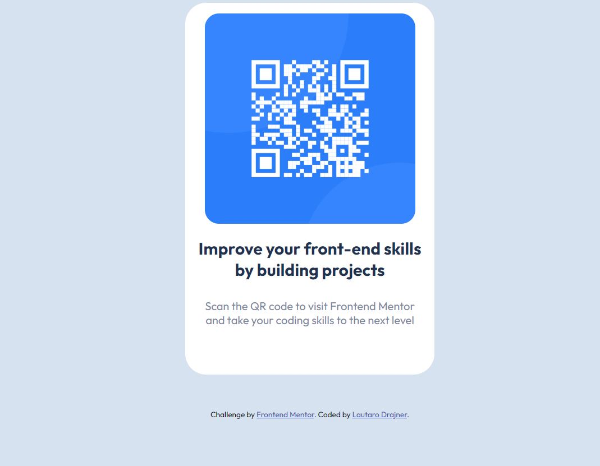

# Frontend Mentor - QR code component solution

This is a solution to the [QR code component challenge on Frontend Mentor](https://www.frontendmentor.io/challenges/qr-code-component-iux_sIO_H). Frontend Mentor challenges help you improve your coding skills by building realistic projects. 

## Table of contents

- [HTML]
- [CSS]

## Overview

A simple proyect for practice the basics of HTML and CSS

### Screenshot

### Links

- Solution URL: [Solution](https://github.com/lauty200413/FEM-Proyect-1-QR-code-component)
- Live Site URL: [live site URL](https://your-live-site-url.com)

### Built with

- HTML
- CSS

### Continued development

I'm currently learning Bootstrap and I want to learn JavaScript and React and some react frameworks and then specialize in Web3

## Author

- Website - [Lauty](https://lauty200413.github.io/Stylised-Personal-Site/)
- Frontend Mentor - [@Anglea Yu](https://www.udemy.com/course/the-complete-web-development-bootcamp/)

